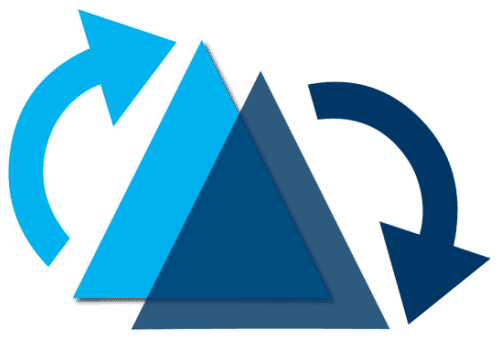

# Hi there, I'm Kevin Yang 👋

## 🔧 Technologies & Tools

### Programming Languages

### Data Engineering

### Machine Learning, AI

### Web, Mobile Development

### Cloud Services, DevOps

## 📚 My Recent Blog Posts

**[Configure Docker to Use Local GPU for Training ML Models](https://medium.com/@kevinsjy997/configure-docker-to-use-local-gpu-for-training-ml-models-70980168ec9b)**  
How to configure your local machine to run a Docker container with access to your GPU devices.  
*Published on July 19, 2023*  

---

**[From Git Flow to CI/CD: A Practical Guide to Implement Git Workflow](https://medium.com/@kevinsjy997/from-git-flow-to-ci-cd-a-practical-guide-to-implement-git-workflow-d2c922f31fdc)**  
Understand the evolution of Git branching models and best practices.  
*Published on July 7, 2023*  

---

**[Fundamental Prompt Engineering Guide with Vertex AI PaLM API](https://medium.com/gopenai/fundamental-prompt-engineering-guide-with-vertex-ai-palm-api-c9f307413d85)**  
Learn basic prompt engineering and using Google Vertex AI Palm 2 API.  
*Published on May 30, 2023*  

---

**[How to Solve “Slow or Stall at Solving Environment on Anaconda”](https://medium.com/@kevinsjy997/how-to-solve-slow-or-stall-at-solving-environment-on-anaconda-6dd32a307a67)**  
How to enhance speed and seamlessly integrate Mamba into your existing conda workflow.  
*Published on May 18, 2023*  

## 📜 Certifications

**[Microsoft Certified: Azure Fundamentals](https://www.credly.com/badges/62760a97-3839-4f89-a835-e07fcea6f144/public_url)**  
Earners of the Azure Fundamentals certification have demonstrated foundational level knowledge of cloud services and how those services are provided with Microsoft Azure.  

_Issued by_ [Microsoft](https://www.credly.com/org/microsoft-certification)  
_Issued on October 28, 2022_

## 🤝 Contributing

If you have any suggestions for improving my projects, feel free to open an issue or create a pull request. Let's make something great together!  

  

